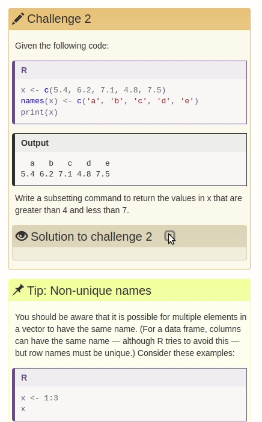

<!-- README.md is generated from README.Rmd. Please edit that file -->

# dovetail

<!-- badges: start -->

[](https://www.tidyverse.org/lifecycle/#experimental)
[](https://CRAN.R-project.org/package=dovetail)
[](https://github.com/carpentries/dovetail/actions)
[](https://codecov.io/gh/carpentries/dovetail?branch=master)
<!-- badges: end -->

> A dovetail joint or simply dovetail is a joinery technique most
> commonly used in woodworking joinery (carpentry) …
> 
> Source: <https://en.wikipedia.org/wiki/Dovetail>

The goal of {dovetail} is to provide a
[{knitr}](https://yihui.org/knitr/) engine that allows users to write
nested div tags or blockquotes containing executable code as
[{roxygen2}](https://r-lib.github.io/roxygen2)-formatted blocks. This
will provide a simpler syntax for construction of [special
blockquotes](https://carpentries.github.io/lesson-example/04-formatting/index.html#special-blockquotes)
in Carpentries lessons. These nested block quotes normally represent
solutions that the learner should not see until they have attempted a
given challenge.

# Usage

To use {dovetail}, add `library("dovetail")` in the setup chunk of your
Rmarkdown document and set the engine to one of the following options:
callout, challenge, checklist, discussion, keypoints, objectives,
prereq, solution, testimonial.

# Installation

This project is currently a Work In Progress, but you can install it
from the Carpentries github account:

``` r
if (!requireNamespace("remotes", quietly = TRUE)) install.packages("remotes")
remotes::install_github("carpentries/dovetail")
```

# Example

Consider the [following block
quote](https://github.com/swcarpentry/r-novice-gapminder/blob/708ab907306ea764d2e279bb6048c6d9913523c3/_episodes_rmd/06-data-subsetting.Rmd#L263-L282)
(taken from [episode 6 of R novice
gapminder](http://swcarpentry.github.io/r-novice-gapminder/06-data-subsetting/index.html#challenge-2))
that gives a challenge block with a single solution block nested within
it.



Written without the {dovetail} engine, the lesson contributor previously
had to write nested block quotes with kramdown tags like so:

    > ## Challenge 2
    > 
    > Given the following code:
    > 
    > 
    > ```r
    > x <- c(5.4, 6.2, 7.1, 4.8, 7.5)
    > names(x) <- c('a', 'b', 'c', 'd', 'e')
    > print(x)
    > ```
    > 
    > Write a subsetting command to return the values in x that are greater than 4 and less than 7.
    > 
    > > ## Solution to challenge 2
    > > 
    > > 
    > > ```r
    > > x_subset <- x[x<7 & x>4]
    > > print(x_subset)
    > > ```
    > {: .solution}
    {: .challenge}

While this solution does provide a way of constructing the nested block
quotes for lessons, it comes with a downside that it’s no longer easy to
evaluate code within these blocks since they are pre-pended by any
number of `>` symbols.

With {dovetail}, the above block quote becomes a series of roxygen
blocks with r-code interspersed. The beginning of a nested block is a
special `#' @solution` tag that will indicate the start of a nested
block:

    ````{challenge}
    #' ## Challenge 2
    #' 
    #' Given the following code:
    #'
    #' ```{r}
    x <- c(5.4, 6.2, 7.1, 4.8, 7.5)
    names(x) <- c('a', 'b', 'c', 'd', 'e')
    print(x)
    #' ```
    #'
    #' Write a subsetting command to return the values in x that are greater than 4 and less than 7.
    #'
    #' @solution Solution to challenge 2
    #'
    #' ```{r}
    x_subset <- x[x<7 & x>4]
    print(x_subset)
    #' ```
    ````

The result looks like this:

```` markdown
<div class='challenge' markdown='1'>

## Challenge 2

Given the following code:

```r
x <- c(5.4, 6.2, 7.1, 4.8, 7.5)
names(x) <- c('a', 'b', 'c', 'd', 'e')
print(x)
```

```
##   a   b   c   d   e 
## 5.4 6.2 7.1 4.8 7.5
```
Write a subsetting command to return the values in x that are greater than 4 and less than 7.

<div class='solution' markdown='1'>

## Solution to challenge 2
 

```r
x_subset <- x[x<7 & x>4]
print(x_subset)
```

```
##   a   b   d 
## 5.4 6.2 4.8
```

</div>

</div>
````
