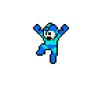

```{r setup, include = FALSE}
library(dovetail)
source(dvt_opts())
f <- function(s, m) paste0(s * m, "px")
knitr::opts_chunk$set(out.width = f(148, 2), out.height = f(125, 2))
```

```{r}

```

```{challenge showme, results = 'asis', out.width = f(148, 5), out.height = f(125, 5)}
#' 
#' Show me an image of megaman, but bigger
#'
#' 
#' 
#' @solution
#' 
#' enhance
#' 
#' ```{r, out.width = f(148, 3), out.height = f(125, 3)}

#' ```
#' 
#' ENHANCE
#'
#' ```{r, echo = FALSE}

#' ```
#'
#' @end
#' 
```
